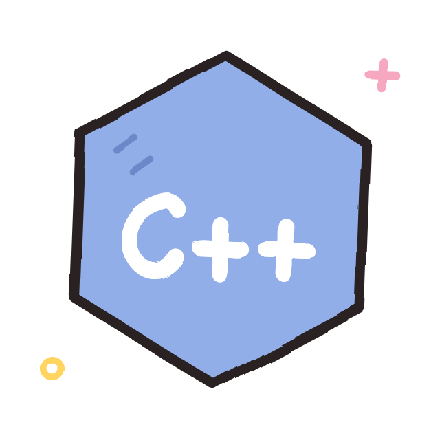
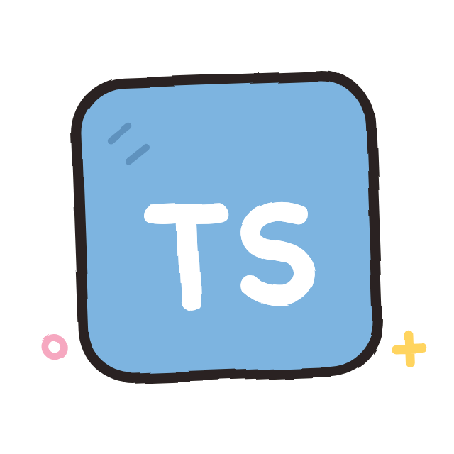
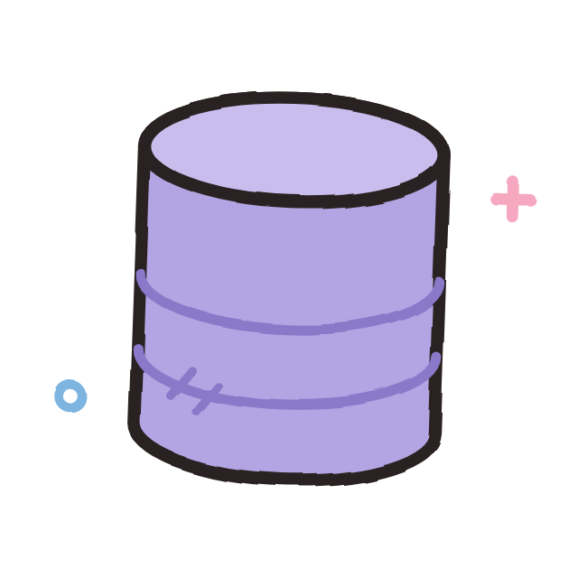
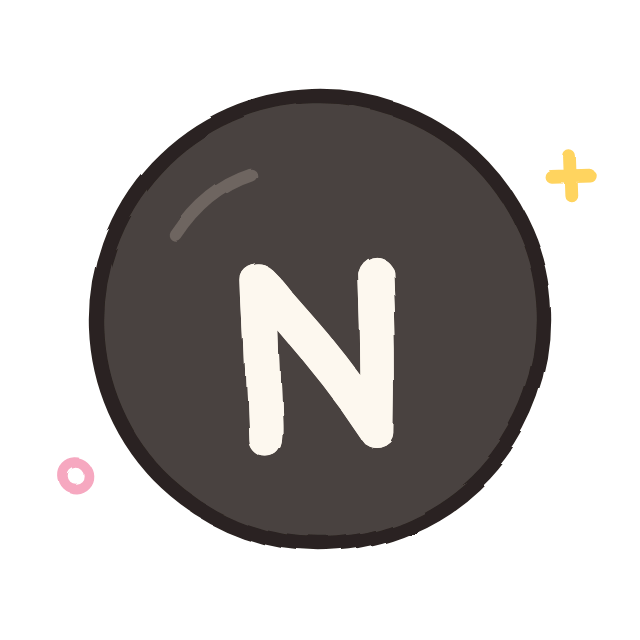
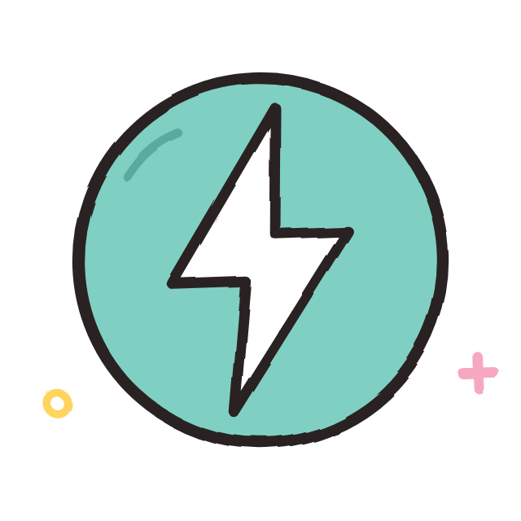
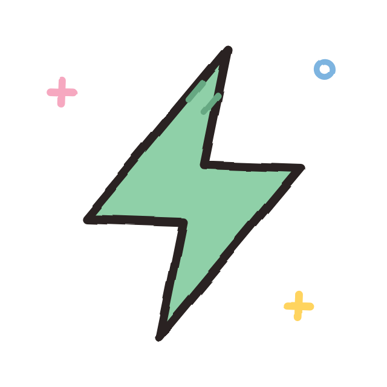
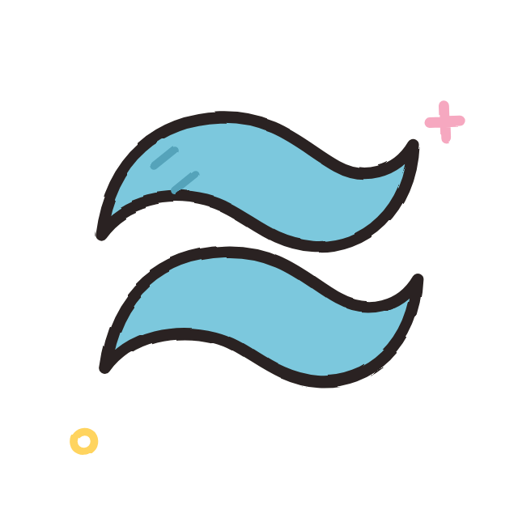
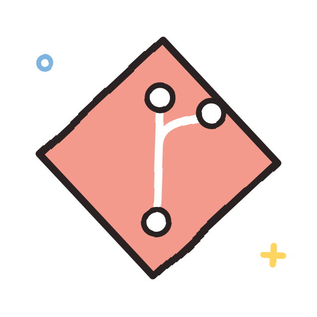
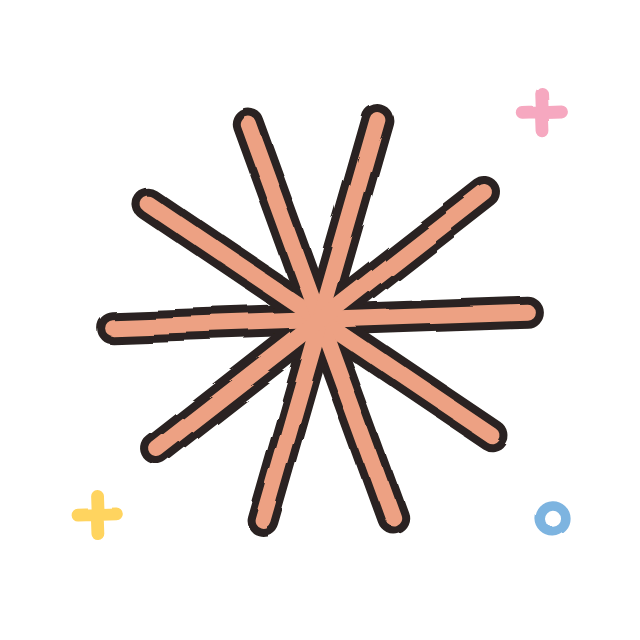

<h1 align="left">hey, i'm selin!</h1>

<p align="left">
  math + cs @ duke 
</p>

<p align="left">
  <a href="https://www.selinmutlu.com/">check me out</a> or
  <a href="mailto:selin.mutlu@duke.edu">contact me</a> :)
</p>

---

```python
def selin():
    studying   = "math + computer science @ duke"
    hometown   = "malverne, new york"
    building   = "whatever i obsess over at that moment"
    into       = ["caffeine", "custom keyboards", "accessibility", "how brains work"]
    off_screen = ["making lattes", "cafe hopping", "attempting to dj", "custom pc builds"]
    return "chalant"
```

### things i've made

| project | what it is |
|---|---|
| **[liftspot](https://liftspot.netlify.app)** | an app to find, rate & review elevators, built for my brother |
| **[normlit](https://v0-normlit-research-assistant-djiy.vercel.app/)** | an ai research assistant for querying academic libraries |
| **[carti-measured](https://github.com/selinmutlu06/carti-measured)** | 84 tracks, 12 audio features, proof fans were right about wlr |

## toolbox

<p align="left">
  <a href="https://www.python.org"></a>
  <a href="https://isocpp.org"></a>
  <a href="https://www.typescriptlang.org"></a>
  <a href="https://en.wikipedia.org/wiki/SQL"></a>
  <a href="https://nextjs.org"></a>
  <a href="https://react.dev"></a>
  <a href="https://fastapi.tiangolo.com"></a>
  <a href="https://supabase.com"></a>
  <a href="https://tailwindcss.com"></a>
  <a href="https://jupyter.org"></a>
  <a href="https://aws.amazon.com"></a>
  <a href="https://git-scm.com"></a>
  <a href="https://claude.com/claude-code"></a>
</p>
